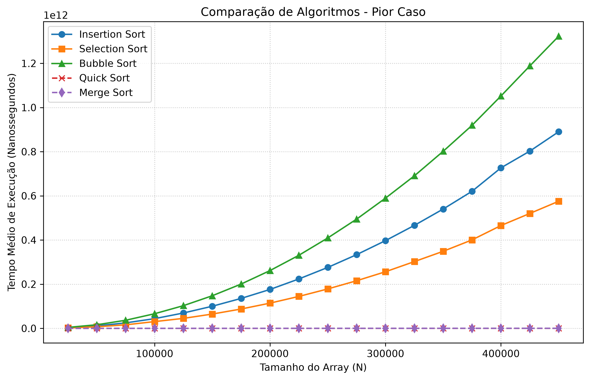
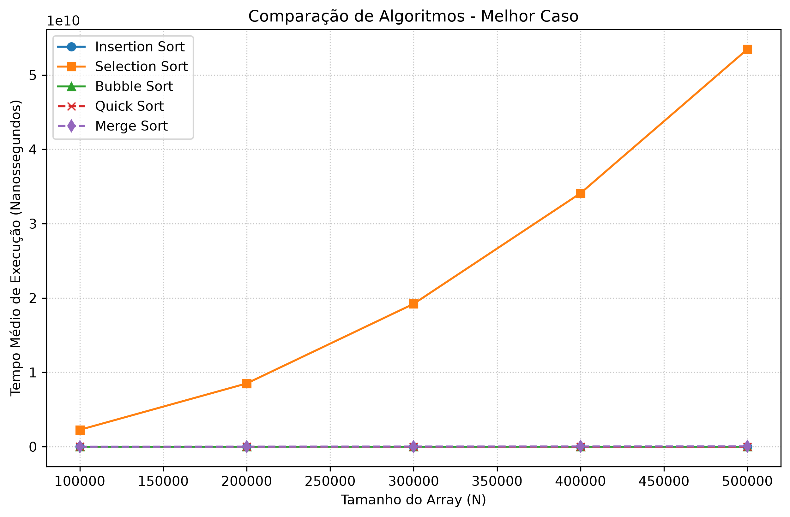

# RELATÓRIO DO TRABALHO 2 - ORDENAÇÃO E ANÁLISE EMPÍRICA

**UNIVERSIDADE FEDERAL DO RIO GRANDE DO NORTE**

**Centro de Ciências Exatas e da Terra**

**Departamento de Informática e Matemática Aplicada**

**Disciplina:** DIM0119 - Estruturas de Dados Básicas 1

**Professor:** Martin A. Musicante

**Autor:** Victor Sobrinho de Santana

## 1. Introdução

Este relatório descreve a implementação e a análise empírica de cinco algoritmos clássicos de ordenação: Insertion Sort, Selection Sort, Bubble Sort, Quick Sort e Merge Sort. O objetivo principal é avaliar o desempenho computacional (tempo de execução) destas estruturas perante diferentes volumes de dados (de 0 a 500.000 elementos) em cenários de Melhor Caso e Pior Caso.

## 2. Instruções de Compilação e Execução

*Conforme exigido, abaixo estão as instruções precisas para reproduzir os testes localmente usando o compilador C++ padrão e o interpretador Python.*

**2.1. Requisitos:**

* Compilador GCC/G++ compatível com C++11 ou superior.

* Python 3.x com a biblioteca `matplotlib` instalada (para geração dos gráficos).

**2.2. Geração dos Dados de Teste:**
Os dados foram gerados utilizando um script Python (`gerador.py`) para respeitar a padronização de arquivos `p<num>v<val>.txt`.

```bash
python gerador.py
```

*(Isto gerará as subpastas `pior_caso` e `melhor_caso` com os vetores preenchidos).*

**2.3. Compilação do Código C++:**
O programa foi modularizado separando a implementação (`sorting.cpp`) das assinaturas (`sorting.hpp`) e do motor de testes (`main.cpp`).

```bash
# Compilação padrão (Pior Caso)
g++ main.cpp sorting.cpp -o teste_ordenacao

# Compilação com otimização extrema (Melhor Caso)
g++ -O3 main.cpp sorting.cpp -o teste_ordenacao
```

**2.4. Execução e Exportação:**
Para rodar os testes e gerar os dados estruturados (formato `.csv` com a média de 5 execuções), utilize os comandos correspondentes ao seu sistema operacional:

**No Windows (PowerShell - forçando codificação limpa):**
```powershell
# 1. Execução do Pior Caso
.\teste_ordenacao.exe | Out-File -Encoding utf8 resultados_finais_piorcaso.csv

# 2. Execução do Melhor Caso (após alterar a pasta no código)
.\teste_ordenacao.exe | Out-File -Encoding utf8 resultados_finais_melhorcaso.csv
```

**No Linux (Terminal/Bash):**
```bash
# 1. Execução do Pior Caso
./teste_ordenacao > resultados_finais_piorcaso.csv

# 2. Execução do Melhor Caso (após alterar a pasta no código)
./teste_ordenacao > resultados_finais_melhorcaso.csv
```

**2.5. Geração dos Gráficos:**

```bash
python plotar_grafico.py
```

## 3. Descrição das Soluções Implementadas

Todas as funções foram implementadas em C++ respeitando estritamente a convenção de intervalo semiaberto `[esq, dir)`, operando de forma que o índice à esquerda é incluído e o índice à direita é excluído do processamento. Códigos devidamente comentados encontram-se nos arquivos fontes.

* **Insertion Sort:** Implementado com um laço que percorre os elementos e os insere na porção já ordenada à esquerda.

* **Selection Sort:** Busca repetidamente o menor elemento do subvetor não ordenado e o move para o início.

* **Bubble Sort:** Compara elementos adjacentes e empurra o maior valor para o final. Inclui uma otimização com uma flag booleana (`trocou`) para interromper a execução precocemente caso o vetor já esteja ordenado.

* **Quick Sort:** Utiliza a abordagem de Divisão e Conquista. Foi implementada uma otimização no particionamento, escolhendo o elemento central como pivô em vez do último, mitigando o risco de *Stack Overflow* em vetores preordenados ou inversamente ordenados.

* **Merge Sort:** Utiliza alocação de vetores temporários na função `merge` para combinar metades previamente ordenadas pela recursão.

## 4. Análise Empírica (Exercício 6)

A medição de tempo foi realizada utilizando a biblioteca `<chrono>` do C++. Para neutralizar flutuações de processamento do sistema operacional, cada algoritmo foi executado 5 vezes para cada tamanho de array, e o valor plotado representa a média desses tempos.

### 4.1. Pior Caso (Vetor em Ordem Decrescente)

*(O vetor exige o número máximo de movimentações para a maioria dos algoritmos)*



**Análise dos Resultados (Pior Caso):**
Como observável no gráfico, há uma divisão clara no comportamento assintótico dos algoritmos. A coleta de dados documentada neste cenário vai até 450.000 elementos:

* Os algoritmos **Bubble Sort, Insertion Sort e Selection Sort** demonstraram um crescimento parabólico drástico, confirmando graficamente a complexidade $O(n^2)$. Dentre eles, o Bubble Sort apresentou, de longe, o pior desempenho absoluto (devido ao número exaustivo de trocas), seguido pelo Insertion Sort e, por fim, o Selection Sort, que obteve o "melhor" tempo entre os três algoritmos quadráticos.

* Em contrapartida, o **Merge Sort e o Quick Sort** mantêm-se como uma linha perfeitamente horizontal e rente ao eixo X (comportamento $O(n \log n)$), demonstrando altíssima eficiência e conveniência absoluta para grandes volumes de dados.

### 4.2. Melhor Caso (Vetor em Ordem Crescente)

*(O vetor já se encontra ordenado)*



**Análise dos Resultados (Melhor Caso):**

* No melhor caso, o **Selection Sort** é o único algoritmo a apresentar uma curva quadrática acentuada. Como ele precisa obrigatoriamente varrer o vetor inteiro em busca do menor valor a cada iteração, ele opera rigidamente em $O(n^2)$ independente do estado prévio do array.

* Os demais algoritmos (**Insertion Sort, Bubble Sort, Quick Sort e Merge Sort**) apresentam um desempenho espetacular (linhas retas coladas ao eixo X). Para o Insertion e o Bubble, isso ocorre graças à otimização do código que reconhece o vetor já ordenado (nenhuma troca efetuada), permitindo que atinjam a complexidade linear $O(n)$. Eles despacham até mesmo 500.000 elementos em frações ínfimas de tempo.

## 5. Comparação Geral e Conclusão

Comparando os resultados obtidos, conclui-se que a escolha do algoritmo mais conveniente depende estritamente do volume de dados e do estado inicial do array:

* **Para arrays pequenos ou quase ordenados:** Insertion Sort ou Bubble Sort são escolhas ideais devido à sua adaptabilidade para rodar em tempo linear $O(n)$, neutralizando a sua desvantagem natural.

* **Para arrays grandes e desordenados:** Quick Sort e Merge Sort são indispensáveis. O Quick Sort leva vantagem no uso de memória (ocupa apenas $O(\log n)$ de espaço na pilha), enquanto o Merge Sort exige espaço extra para os vetores temporários ($O(n)$), porém garante estabilidade e desempenho $O(n \log n)$ independentemente do cenário.

* **Selection Sort:** Demonstrou ser a implementação menos versátil e menos conveniente na prática para conjuntos extensos de dados, uma vez que não tira nenhum proveito de ordenações pré-existentes.

## 6. Limitações e Dificuldades

Durante a execução do trabalho, algumas dificuldades técnicas precisaram ser contornadas:

1. **Stack Overflow no Quick Sort:** Ao processar o Pior Caso em arrays superiores a 50.000 elementos, o Quick Sort clássico (com o pivô na última posição) entrava em colapso devido à excessiva profundidade da recursão (esgotamento da pilha de chamadas). Isso foi resolvido otimizando a escolha do pivô para o elemento central do array.

2. **Tempo Extremo no Pior Caso:** A validação empírica demonstrou ser severamente limitante para o hardware. A execução do Pior Caso para algoritmos $O(n^2)$ arrastou-se por mais de 24 horas ininterruptas. Por este motivo, o processo foi abortado de forma segura e controlada na marca dos 450.000 elementos para viabilizar a entrega do estudo em tempo hábil. O tamanho coletado provou-se mais do que suficiente para comprovar graficamente a curva exponencial.

3. **Codificação de Arquivos no Terminal:** O redirecionamento de dados de saída (stdout) para arquivos `.csv` via PowerShell no Windows gerou incompatibilidades de codificação (injeção de bytes `\x00`), o que impedia a leitura correta pelo script Python. O problema foi superado forçando a formatação UTF-8 na exportação.

4. **Otimização no Melhor Caso:** Devido ao custo computacional permanentemente elevado do algoritmo Selection Sort (mantendo-se rigidamente em $O(n^2)$ no melhor caso), optou-se por utilizar amostragens com saltos de 100.000 elementos e ativar a flag de otimização máxima (`-O3`) no compilador GCC para garantir a conclusão célere desta bateria final de testes.